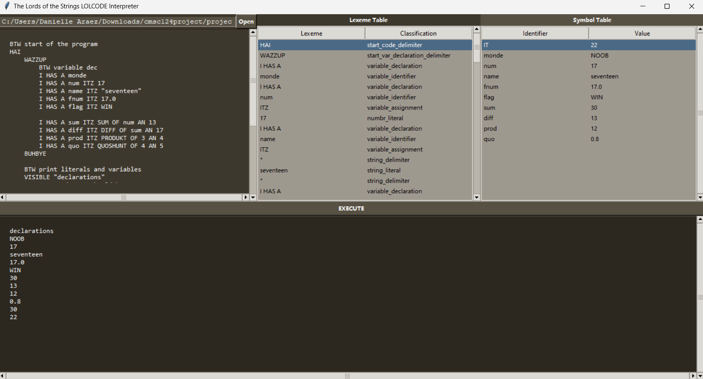

# CMSC 124 ST2L Project: LolCode Interpreter

### GROUP NAME

The Lords of the Strings

### GROUP MEMBERS

- Araez, Danielle Lei R.
- Cinense, Njord Daniel P.
- Latigay, Jaymart G.

### INSTRUCTIONS

1. Download the required packages using the commands below:

   ```bash
   pip install regex
   pip install pygame==2.0.1
   pip install tk
   pip install random
   ```

2. Run the program using the command below:

   ```bash
   python main.py
   ```

3. Click the "Open" button to select a LolCode file to be interpreted.

4. Click the "Run" button to run the interpreter and show the output on the console.

### SCREENSHOTS

_Image of LolCode Interpreter_


### REFERENCES

LolCode Guide

- https://www.tutorialspoint.com/lolcode/lolcode_syntax.htm

LolCode Online Compilers

- https://www.jdoodle.com/execute-lolcode-online/
- https://www.tutorialspoint.com/execute_lolcode_online.php

Lexical Analyzer

- https://www.youtube.com/watch?v=YYvBy0vqcSw&list=PLZQftyCk7_SdoVexSmwy_tBgs7P0b97yD&index=4

Syntax and Semantic Analyzer

- https://www.youtube.com/watch?v=YYvBy0vqcSw&list=PLZQftyCk7_SdoVexSmwy_tBgs7P0b97yD&index=4
- https://github.com/TheIvoryCoder/Make_Your_OWN_Coding_Language/tree/main/Ep2
